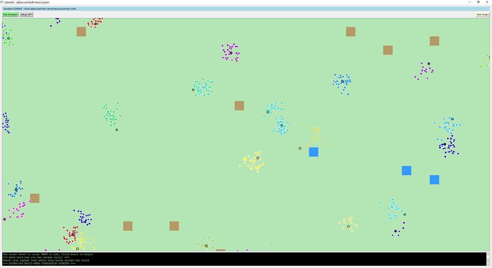
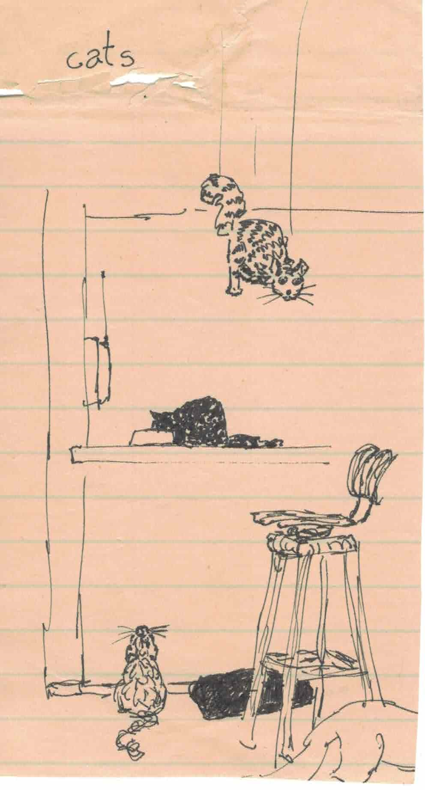

# === README.md ===
# 2dsim08 - Alpha-Led Multi-Herd Simulation

A multithreaded creature simulation featuring alpha-led herding behavior. Watch as 80 alpha leaders (with black rings) guide their colorful herds around a vast world using emergent flocking behaviors.



## Features

- **Alpha-Led Herding**: 80 alpha creatures lead herds of followers in coordinated movement
- **Multithreaded Processing**: Utilizes all available CPU cores for smooth simulation of 2000+ creatures
- **Dynamic Herd Colors**: Each herd has its own unique color for easy visual identification
- **Interactive Controls**: Mouse wheel zoom, WASD panning, real-time start/stop
- **Debug Controls**: Toggle thread activity logging on/off
- **Terrain System**: Creatures interact with different terrain types (foliage, sand, water)

## Requirements

### Prerequisites
- **Qt 6.x** or **Qt 5.15+** (Qt 6 recommended)
- **C++17** compatible compiler
- **CMake 3.16+** or **qmake** (depending on build system preference)

### Supported Platforms
- Windows 10/11 (MSVC 2019+, MinGW)
- macOS 10.15+ (Xcode 12+)
- Linux (GCC 9+, Clang 10+)

## Building

### Option 1: Qt Creator (Recommended)
1. Install Qt Creator and Qt 6.x from [qt.io](https://www.qt.io/download)
2. Clone this repository:
   ```bash
   git clone https://github.com/isc1/2dsim08.git
   cd 2dsim08
   ```
3. Open Qt Creator
4. File → Open File or Project → Select `2dsim08.pro` (or `CMakeLists.txt`)
5. Configure the project with your Qt kit
6. Build → Build Project "2dsim08" (Ctrl+B)
7. Run → Run (Ctrl+R)

### Option 2: Command Line with qmake
```bash
git clone https://github.com/isc1/2dsim08.git
cd 2dsim08

# Generate Makefile
qmake 2dsim08.pro

# Build (Windows)
nmake        # MSVC
mingw32-make # MinGW

# Build (macOS/Linux)
make

# Run
./2dsim08    # macOS/Linux
2dsim08.exe  # Windows
```

### Option 3: Command Line with CMake
```bash
git clone https://github.com/isc1/2dsim08.git
cd 2dsim08
mkdir build && cd build

# Configure
cmake ..

# Build
cmake --build . --config Release

# Run
./2dsim08    # macOS/Linux
Release/2dsim08.exe  # Windows
```

## Project Structure

```
2dsim08/
├── main.cpp           # Application entry point
├── mainwindow.h       # Main window class declaration
├── mainwindow.cpp     # Core simulation logic and GUI
├── 2dsim08.pro       # qmake project file
├── CMakeLists.txt    # CMake project file (optional)
└── README.md         # This file
```

## Usage

1. **Launch** the application
2. **Start Simulation** - Click the green "Start Simulation" button
3. **Navigate** - Use mouse wheel to zoom, WASD keys to pan around the world
4. **Debug Toggle** - Click "Debug: OFF/ON" to show/hide thread activity messages
5. **Clear Output** - Click "Clear Output" to clean the message log

### What You'll See
- **Black-ringed circles**: Alpha leaders choosing destinations and leading their herds
- **White-ringed colored circles**: Herd members following their alphas in coordinated groups
- **Terrain**: Green (foliage), brown (sand), blue (water) background squares
- **Red rotating square**: Metronome indicator showing simulation is running

## Performance Notes

- Optimized for **2000 creatures** with **80 herds** by default
- Uses **multithreading** (cores - 1) for creature AI processing
- Runs at **50 FPS** (20ms update interval)
- **World size**: 100,000 × 56,250 coordinate units
- **Memory usage**: ~50-100MB typical

## Configuration

Key constants in `mainwindow.h` can be modified:

```cpp
static const int STARTING_CREATURE_COUNT = 2000;    // Total creatures
static const int ALPHA_RATIO = 25;                  // 1 alpha per 25 creatures
static const int HERD_GROUP_FOOTPRINT_SIZE = 1000;  // Herd spread radius
static const int ALPHA_NORMAL_WANDER_DISTANCE = 2500; // Alpha movement range
```

## Troubleshooting

### Build Issues
- **Qt not found**: Ensure Qt is in your PATH or set `CMAKE_PREFIX_PATH`
- **C++17 errors**: Update to GCC 9+, Clang 10+, or MSVC 2019+
- **Missing widgets**: Install Qt Widgets module: `qt6-base-dev` (Linux)

### Runtime Issues
- **Slow performance**: Reduce `STARTING_CREATURE_COUNT` or disable debug output
- **Threading errors**: Ensure Qt was built with threading support
- **Graphics issues**: Update graphics drivers, try software rendering

### Common Fixes
```bash
# Linux: Install Qt development packages
sudo apt install qt6-base-dev qt6-tools-dev build-essential

# macOS: Install via Homebrew
brew install qt

# Windows: Download Qt installer from qt.io
```

## Development

This is an experimental simulation exploring emergent flocking behaviors and multithreaded game development patterns. The codebase demonstrates:

- **Qt Graphics Framework** usage for 2D rendering
- **QThreadPool** for parallel creature AI processing  
- **State machine patterns** for creature behavior
- **Spatial partitioning** concepts for large-scale simulations

This software, and the nice documentation for it in this README.md so far, was written by Claude Sonnet 4 in June of 2025.

## License

This is free and unencumbered software released into the public domain.

Anyone is free to copy, modify, publish, use, compile, sell, or
distribute this software, either in source code form or as a compiled
binary, for any purpose, commercial or non-commercial, and by any
means.

In jurisdictions that recognize copyright laws, the author or authors
of this software dedicate any and all copyright interest in the
software to the public domain. We make this dedication for the benefit
of the public at large and to the detriment of our heirs and
successors. We intend this dedication to be an overt act of
relinquishment in perpetuity of all present and future rights to this
software under copyright law.

THE SOFTWARE IS PROVIDED "AS IS", WITHOUT WARRANTY OF ANY KIND,
EXPRESS OR IMPLIED, INCLUDING BUT NOT LIMITED TO THE WARRANTIES OF
MERCHANTABILITY, FITNESS FOR A PARTICULAR PURPOSE AND NONINFRINGEMENT.
IN NO EVENT SHALL THE AUTHORS BE LIABLE FOR ANY CLAIM, DAMAGES OR
OTHER LIABILITY, WHETHER IN AN ACTION OF CONTRACT, TORT OR OTHERWISE,
ARISING FROM, OUT OF OR IN CONNECTION WITH THE SOFTWARE OR THE USE OR
OTHER DEALINGS IN THE SOFTWARE.

For more information, please refer to <https://unlicense.org/>

## Contributing

This project is not currently accepting contributions as I want to leave it like it is because it is a good starting point for lots of other little projects for me.

## Vibe Coding Proompting Discussion
I've been playing around with little creature simulations in Qt for years.  Some of them would eat plants that spawned occasionally and die if they didn't get fed.  Some would chase each other around.  Generally, I found that Qt could do logic for about 500 creatures in the main thread before it would start to slow down and the creatures movements would start to become jerky.  If the logic was very simple, it could do 1000 or so.  I always wanted to do a multithreaded version so I could have more creatures but I'm lazy--and can come up with a bunch more excuses besides "lazy" if required--most having to do with character defects and attitude problems and so forth.

So I never did it.  I fiddled around learning about Qt multithreading in an offhand way, but mutexes and critical sections are not as fun to work on as getting a dot-shaped cat to chase a bunch of dot-shaped mice.

But recently I tried this vibe coding thing, where I just let the LM write all the code.  I didn't write a lick.  I tweaked parameters, and I think I fixed one very small bug that I may have created myself when I changed some variable names.  Other than that, Claude wrote all the code.

It's less than 1,000 lines, so it's not big project, but it demonstrates some things well for anyone who... wants to try working on games in C++ on Qt... in 2025... lol.  Hey people are allowed to have weird hobbies what can I say.

So for anyone who hasn't tried to use these LMs to write code, or has tried and had difficulty, for example people who are just learning how to program, I thought I would include the conversation I had with Claude to get the code to the state is is in on 20250609.

I'm going to put the discussion between Claude and I in here first, and then I _may_ put copies of the code buffers in here, or links to them, I'm not sure.  That would add a bunch of time to do by hand, and I don't believe Claude has a convo export capability yet.

Oh yeah, there is a python program in here called src2file.py.  If you run this in the directory where your source files are located, it will create a file called consolidated_source.txt (or consolidated_source_n.txt if you want a file with line numbers, just pass in -n when you invoke it) which puts all the source in one file.  This makes pasting all the source into claude's prompt window easy.

[TODO:  put the vibe coding conversation in here]


# [ALL MY FRIENDS ARE DEAD](https://youtu.be/8LvuBvgIKyw "Title" target="_blank")

